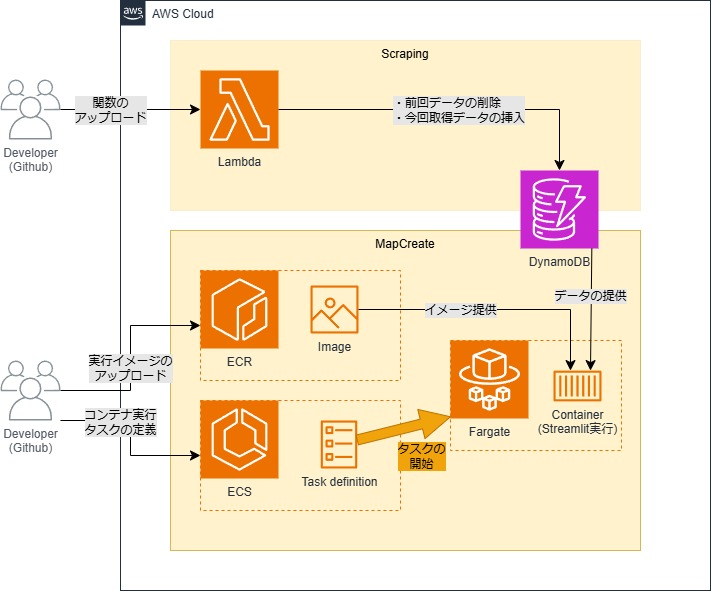

# AWS環境へのデプロイ (staging)

サーバーレスサービスを利用する方法で検討

## 概要アーキテクチャ図

<div align="center">

</div>

## 料金発生ポイント
- Lambda
    - 無制限無料枠(いつまでも無料)の使用範囲内での利用想定
    - リクエスト数や秒数に使用範囲が設定されているので, 長い時間/大量のページ数処理ははみ出す可能性あり
    - スクレイピングページ数は小さく設定するようにする
- DynamoDB
    - 無制限無料枠の使用範囲(25GB)内での利用想定
    - レコードが増えるとはみ出す可能性もあるので, スクレイピングページ数は小さく設定するようにする
- ECR
    - プライベートリポジトリは12か月無料枠あり(500MB/月)
        - 12か月無料枠を超えると1GB/月あたり0.1$
    - パブリックリポジトリなら常時無料枠が50GB/月があるので, 公開前提でなら無料運用可能
- ECS
    - Fargate
        - 初期設定の状態で1分あたり0.03$

## AWSの準備
### IAMユーザのセットアップ
1. ユーザーの作成
    IAMコンソールにアクセスし, Staging環境を管理する「ユーザーの作成」を行う
    1. ユーザー名に適当な名前を入力する
    1. 次に進み, 「ポリシーを直接アタッチする」を選択し, 以下のポリシーを追加する
        - AmazonDynamoDBFullAccess
        - AmazonEC2ContainerRegistryPowerUser
        - AmazonS3FullAccess
        - AWSLambda_FullAccess
    1. 次に進んでユーザーを作成する
    1. ユーザー一覧から作成したユーザーを選択し, 「セキュリティ認証情報」のタブから「アクセスキーを作成」を行う
        1. ユースケースは「CLI」を選択し, 確認欄にチェックを入れて次へ進み, そのままアクセスキーを作成する
        1. 取得したアクセスキーのKEY_IDとSECRET_ACCESS_KEYを控えておく
### DynamoDBのセットアップ
1. テーブルの作成
    DynamoDBのコンソールにアクセスし, スクレイピング結果を管理するテーブルを作成する
    1. 「テーブルの作成」を選択
    1. 適当なテーブル名を入力し, パーティションキーに「id」を入力しておく
### Lambdaのセットアップ
1. 関数を作成する
    Lambdaのコンソールにアクセスし, スクレイピングを実行する関数を作成する
    1. 関数名に適当な関数名を入力し, ランタイムで「Python3.12」を選択し, 「関数の作成」を行う
    1. 作成された関数のコンソールから「設定」タブ中の「一般設定」タブの「編集」を選択し, タイムアウトを1分に設定して保存する
1. DynamoDBへのアクセス権限を設定する
    作成後に開く関数のコンソールから, DynamoDBへのアクセスを許可するように設定する
    1. 「設定」タブの「アクセス権限」タブから実行ロールのロール名を選択し, IAMコンソールへ移動する
    1. 「許可」タブの許可ポリシーから「許可を追加」>「インラインポリシーを追加」を選択
    1. 「json」タブを選択し, エディタに以下をコピペする (Resorce欄は適宜変更. DynamoDBテーブルのARNはDynamoDBのコンソールからも確認可能)

        ```json
        {
            "Version": "2012-10-17",
            "Statement": [
                {
                    "Effect": "Allow",
                    "Action": [
                        "dynamodb:PutItem",
                        "dynamodb:DeleteItem",
                        "dynamodb:Scan",
                        "dynamodb:DescribeTable",
                        "dynamodb:BatchWriteItem"
                    ],
                    "Resource": "arn:aws:dynamodb:us-east-1:<自分のアカウントID>:table/<DynamoDBのテーブル名>"
                }
            ]
        }
        ```
    1. 次へ進み, 適当なポリシー名を入力して「ポリシーの作成」を実行する
1. AWS CLIからのアクセス権限を設定する
    Githubからの関数更新のために, IAMユーザーにLambdaの関数を更新する権限を設定する
    1. IAMコンソールの「ポリシー」タブから「ポリシーの作成」を行う
    1. 「json」タブを選択し, エディタに以下をコピペする

        ```json
        {
            "Version": "2012-10-17",
            "Statement": [
                {
                    "Effect": "Allow",
                    "Action": [
                        "lambda:UpdateFunctionCode",
                        "lambda:GetFunctionConfiguration"
                    ],
                    "Resource": "arn:aws:lambda:us-east-1:<自分のアカウントID>:function:<Lambdaの関数名>"
                }
            ]
        }
        ```
    1. 次へ進み, 適当なポリシー名を入力して「ポリシーの作成」を実行する
    1. 作成したポリシーのコンソールから「アタッチされたエンティティ」タブの「アタッチ」を選択
    1. IAMユーザーを選択し, 「ポリシーをアタッチ」する
### ECRのセットアップ
1. リポジトリの作成
    Amazon ECR(Elastic Container Registry)のコンソールからコンテナイメージを登録するリポジトリの作成を行う
    1. 「リポジトリの作成」へ進み, リポジトリ名に適当なリポジトリ名を入力して「作成」を実行する
### ECSのセットアップ
1. AIMロールの作成
    StreamlitのコードがECSからDynamoDBにアクセスできるように, ロールを作成しておく
    1. AIMコンソールの「ロール」タブから「ロールの作成」へ進む
    1. 信頼されたエンティティタイプは「AWSのサービス」を選択し, ユースケースは「Elastic Container Service」の「Elastic Container Service Task」を選択して「次へ」進む
    1. 許可ポリシーでは「AmazonDynamoDBFullAccess」を選択する
    1. ロール名に適当なロール名を入力して「ロールを作成」を実行する
1. クラスター/タスクの作成
    Amazon ECS(Elastic Container Service)のコンソールからStreamlitを実行するサービスのクラスターとタスクを作成する
    1. 「クラスター」タブから「クラスターの作成」へ進み, クラスター名に適当なクラスター名を入力, インフラストラクチャがFargateになっていることを確認して「作成」を実行する
    1. 「タスク定義」タブから「新しいタスク定義の作成」へ進む
        1. タスク定義ファミリーに適当なタスク名を入力する
        1. タスクロールは1で作成しAIMロールを選択する
        1. コンテナ-1の名前には適当な名前を入力し, イメージURIに「<自分のアカウントID>.dkr.ecr.us-east-1.amazonaws.com/<ECRのリポジトリ名>:latest」を入力, ポートマッピングのポート名に「8501」を入力する
1. AWS CLIからのアクセス権限を設定する
    Githubからのタスクの実行のために, IAMユーザーに実行権限を設定する
    1. IAMコンソールの「ポリシー」タブから「ポリシーの作成」を行う
    1. 「json」タブを選択し, エディタに以下をコピペする

        ```json
        {
            "Version": "2012-10-17",
            "Statement": [
                {
                    "Effect": "Allow",
                    "Action": [
                        "ecs:RunTask",
                        "ecs:DescribeTasks",
                        "ecs:DescribeTaskDefinition",
                        "ecs:DescribeClusters"
                    ],
                    "Resource": [
                        "arn:aws:ecs:us-east-1:<自分のアカウントID>:cluster/<ECRのクラスター名>",
                        "arn:aws:ecs:us-east-1:<自分のアカウントID>:task-definition/<ECRのタスク定義名>:1",
                        "arn:aws:ecs:us-east-1:<自分のアカウントID>:task/<ECRのタスク定義名>/*"
                    ]
                },
                {
                    "Effect": "Allow",
                    "Action": [
                        "iam:PassRole"
                    ],
                    "Resource": [
                        "arn:aws:iam::<自分のアカウントID>:role/ecsTaskExecutionRole",
                        "arn:aws:iam::<自分のアカウントID>:role/<ECRからDynamoDBへのアクセス権限ロール名>"
                    ]
                }
            ]
        }
        ```
    1. 次へ進み, 適当なポリシー名を入力して「ポリシーの作成」を実行する
    1. 作成したポリシーのコンソールから「アタッチされたエンティティ」タブの「アタッチ」を選択
    1. IAMユーザーを選択し, 「ポリシーをアタッチ」する

## デプロイ
### デプロイの準備
デプロイのためにコードを修正する
1. scrap.py, app_estate.pyの修正をそれぞれscraping/lambda_function.py, mapcreate/app_estate.pyに反映させる
1. 依存モジュールに変更があった場合はscraping/requirements.txt, mapcreate/requirements.txtを変更する
1. (初回のみ) scraping/lambda_function.pyとmapcreate/app_estate.pyの`DATABASE_NAME`を作成したDynamoDBのテーブル名に変更する
## 手動でデプロイする
コンソールを使用してデプロイする方法を記載する
### スクレイピングのデプロイ
1. scraping配下に移動し, make_lambda_zip.shを実行する
    実行後, リポジトリのルートディレクトリにzipファイルが作成される
1. Lambdaのコンソールから関数を選択し, 「コード」タブの「アップロード元」から「.zipファイルをアップロード」を選択する
1. 「アップロード」から1で作成したzipファイルを選択し「保存」する
1. 「テスト」タブへ移動し, 「テスト」を実行する
    実行中の関数が成功し, "statusCode" 200が返ってきていれば成功.
### Streamlitのデプロイ
1. (初回のみ) `aws configure`コマンドから以下の項目を設定しておく
    - AWS Access Key ID：作成したIAMユーザーのACCESS_KEY_ID
    - AWS Secret Access Key：作成したIAMユーザーのSECRET_ACCESS_KEY
    - Default region name：us-east-1
1. (初回のみ) レジストリに対してDockerクライアントを認証する
    ```bash
    aws ecr get-login-password --region us-east-1 | docker login --username AWS --password-stdin <自分のアカウントID>.dkr.ecr.us-east-1.amazonaws.com
    ```
    - このあたりのコマンドはECRコンソールのリポジトリから「プッシュコマンドを表示」で表示される
1. mapcreate配下に移動し, dockerファイルをbuildする
    ```bash
    docker build -t <ECRのリポジトリ名> .
    ```
1. イメージのタグを付与してプッシュする
    ```bash
    docker tag <ECRのリポジトリ名>:latest 851725237989.dkr.ecr.us-east-1.amazonaws.com/<ECRのリポジトリ名>:latest
    docker push <自分のアカウントID>.dkr.ecr.us-east-1.amazonaws.com/<ECRのリポジトリ名>:latest
    ```
    うまくできていればECRのコンソールからイメージの確認ができる
1. ECSでタスクの実行をする
    1. ECSのコンソールで「タスク定義」タブから作成したタスクを選択し, 「デプロイ」ボタンから「タスクの実行」を選択し, 「作成」を実行する
    1. 出てくるタスク定義のコンソールから「タスク」タブ内に新しいタスクが追加されているので, それを選択する
    1. タスクコンソールの「設定」タブ内のパブリックIPを確認し, 別ウィンドウで「http://<パブリックIP>:8501」にアクセスしてページを確認する

## Github Actionsによる自動デプロイ
.github/workflows/deploy.yml で自動デプロイを行える.
トリガーは`stage`ブランチにpushが発生したとき
1. 準備
    - リポジトリに以下のRepository secretsを追加しておく
        - AWS_ACCESS_KEY_ID：IAMユーザーのKEY_ID
        - AWS_SECRET_ACCESS_KEY：IAMユーザーのSECRET_ACCESS_KEY
    - .github/workflows/deploy.ymlを修正する
        - ARS内に含まれるアカウントIDを自分のものに変更する
        - タスクのサブネットマスクとセキュリティグループを変更する
            - いったんデフォルトのものを使用
                - サブネットマスクはVPCコンソール一覧のvpcからサブネット一覧を確認できる
                - セキュリティグループはEC2コンソールの「セキュリティグループ」タブから確認できる
1. 実行
    - `stage`ブランチに変更をプッシュするとGithub Actionsにより自動デプロイが実行される
    - ECSコンソールへアクセスし, パブリックIPを確認して, 別ウィンドウで「http://<パブリックIP>:8501」にアクセスしてページを確認する
